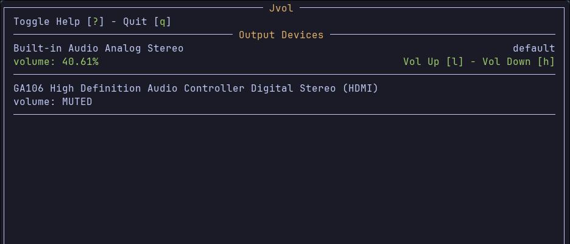

# Jvol: Terminal TUI Pulse Audio Control

Control your Pulse Audio volume levels with a text user interface from the terminal.

 

### Features

- Control the volume levels for Output and Input devices.
- Mute any selected Input/Output devices.
- Set any selected Input/Output devices as the default device.

# Usage

No configuration required

| Action | Key |
| -------------- | --------------- |
| Show Output Devices | 1 |
| Show Input Devices | 2 |
| Toggle Help | ? |
| Quit | q |
| Select Up | k |
| Select Down | j |
| Vol Up 10% | l |
| Vol Down 10%| h |
| Vol Up 1% | shift + l |
| Vol Down 1%| shift + h |
| Mute Selected | m |
| Set Default Device | d |
| Refresh Device List | r |

# Download

Binaries are available in the [releases](https://github.com/Jkeyuk/Jvol/releases) section.

Simply download the binary run `chmod +x ./jvol` and use where ever you want.

# Building

### Dependencies

Build Tool: Cmake 3.25.1

Dependencies: PulseAudio Ncurses

### Initialize build directory
```bash
mkdir build && cd build
cmake ..
```

### Build project

From the build directory you can run.

```bash
make
```

### Install project

From the build directory you can run.

```bash
make && sudo make install
```
